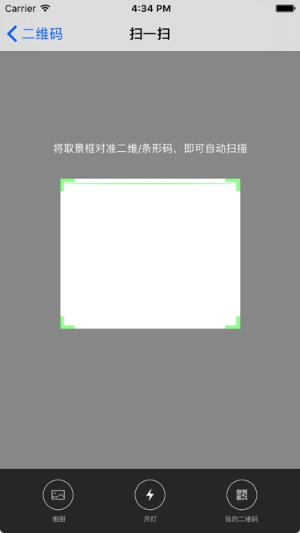
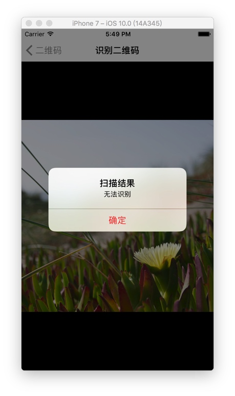

###  一键集成二维码扫描、生成、识别

-------

基于swift3.0

> 1.扫描二维码




> 2.二维码生成
    


> 3.识别二维码




使用(建议使用子线程)


```  
DispatchQueue.global().async {
                
let image = content.generateQRCodeWithLogo(logo: self.logoImageView.image)
                DispatchQueue.main.async(execute: {
                    self.QRCodeImageView.image = image
                })
                
            }
```


```
DispatchQueue.global().async {
            let recognizeResult = self.sourceImage?.recognizeQRCode()
            let result = recognizeResult?.characters.count > 0 ? recognizeResult : "无法识别"
            DispatchQueue.main.async {
                Tool.confirm(title: "扫描结果", message: result, controller: self)
                self.activityIndicatoryView.stopAnimating()
            }
        }
```


-------
封装接口:

```
   /**
     1.生成二维码
     
     - returns: 黑白普通二维码(大小为300)
     */
    
    func generateQRCode() -> UIImage
    
    
        /**
     2.生成二维码
     
     - parameter size: 大小
     
     - returns: 生成带大小参数的黑白普通二维码
     */
     func generateQRCodeWithSize(size:CGFloat?) -> UIImage
     
     
         /**
     3.生成二维码
     
     - parameter logo: 图标
     
     - returns: 生成带Logo二维码(大小:300)
     */
     func generateQRCodeWithLogo(logo:UIImage?) -> UIImage
     
     
         /**
     4.生成二维码
     
     - parameter size: 大小
     - parameter logo: 图标
     
     - returns: 生成大小和Logo的二维码
     */
    func generateQRCode(size:CGFloat?,logo:UIImage?) -> UIImage
    
    
        /**
     5.生成二维码
     
     - parameter size:    大小
     - parameter color:   颜色
     - parameter bgColor: 背景颜色
     - parameter logo:    图标
     
     - returns: 带Logo、颜色二维码
     */
    func generateQRCode(size:CGFloat?,color:UIColor?,bgColor:UIColor?,logo:UIImage?) -> UIImage
    
    
        /**
     6.生成二维码
     
     - parameter size:            大小
     - parameter color:           颜色
     - parameter bgColor:         背景颜色
     - parameter logo:            图标
     - parameter radius:          圆角
     - parameter borderLineWidth: 线宽
     - parameter borderLineColor: 线颜色
     - parameter boderWidth:      带宽
     - parameter borderColor:     带颜色
     
     - returns: 自定义二维码
     */
    func generateQRCode(size:CGFloat?,color:UIColor?,bgColor:UIColor?,logo:UIImage?,radius:CGFloat,borderLineWidth:CGFloat?,borderLineColor:UIColor?,boderWidth:CGFloat?,borderColor:UIColor?) -> UIImage
    
```


```
/**
     1.识别图片二维码
     
     - returns: 二维码内容
     */
    func recognizeQRCode() -> String?
    {
            
        let detector = CIDetector(ofType: CIDetectorTypeQRCode, context: nil, options: [CIDetectorAccuracy : CIDetectorAccuracyHigh])
        let features = detector?.features(in: CoreImage.CIImage(cgImage: self.cgImage!))
        guard (features?.count)! > 0 else { return nil }
        let feature = features?.first as? CIQRCodeFeature
        return feature?.messageString
        
    }
```


详情请查看我的博客:[二维码扫描、生成、识别 (swift3.0)](http://www.jianshu.com/p/93d7a4b9b8f6)  
如果碰到有什么问题欢迎给我留言


